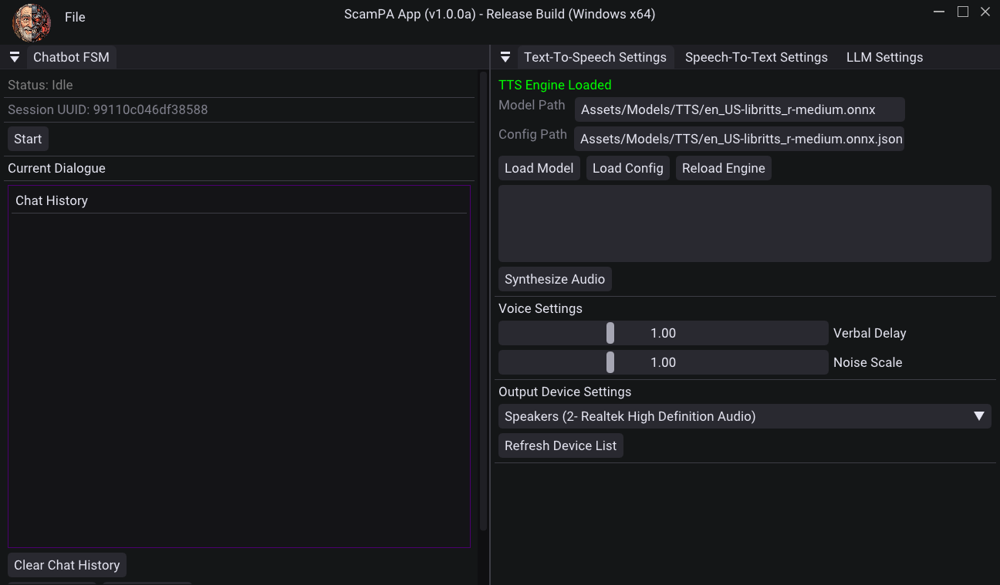

  

# ScamPA - The Scam Preventing Agent
ScamPA is a simple, offline C++ application designed with the purpose of being able to hinder the possibility of potential phone scams by utilizing ML bots to automate calls with malicious telemarketers.
This application is currently a work-in-progress and only supports Windows - with macOS and Linux support planned. Setup scripts support Visual Studio 2026 by default.

The application framework itself is essentially a heavily modified version of the [Walnut](https://github.com/StudioCherno/Walnut) framework.

_
ScamPA v1.0.0a Release Build Screenshot
_

## Requirements
- [Visual Studio 2026](https://visualstudio.com) (not strictly required, however included setup scripts only support this)
    - Note: For Visual Studio 2022 or lower, you'll need to either comment out the `toolset "v145"` line within each premake scripts, or update them according to your current toolset version 

- [Vulkan SDK](https://vulkan.lunarg.com/sdk/home#windows) (version 1.3.283.0)
    - Will be installed for you upon running `Setup.bat`

- Python 3
    - To able to run the setup scripts

## Getting Started
- Open your terminal (or command prompt for Windows), then run `git clone https://github.com/cpap7/ScamPA.git --recursive` to your working directory of choice.
- Once you've cloned, run `Scripts/Setup.bat` to generate Visual Studio solution & project files.
- Navigate over to `/Vendor/VoxBoxSDK/Scripts` and run the `Win-GenDependencies` batch script to build its dependencies. 
- When you've opened the ScamPA solution, you can build the ScamPA-App project in Visual Studio 2026, and use it.
    - NOTE: Some models have been provided for you within the repo (i.e., under ScamPA-App/Assets/Models/LLM). Other models will require you to download them separately (check Assets/Models/TTS & STT folders for more info). You can either hard-code their file paths within AppLayer.cpp or load them manually in while running the client itself.

## 3rd party libaries
- [Dear ImGui](https://github.com/ocornut/imgui) - Bloat-free, immediate-mode graphical user interface library 
- [GLFW](https://github.com/glfw/glfw) - Cross-platform library for OpenGL, OpenGL ES & Vulkan application development
- [stb_image](https://github.com/nothings/stb) - Image-loading library
- [GLM](https://github.com/g-truc/glm) - Math library
- [spdlog](https://github.com/gabime/spdlog) - Logging library
- [yaml-cpp](https://github.com/jbeder/yaml-cpp) & [json](https://github.com/nlohmann/json) - Chatlog serialization
(included for convenience)

## Custom libraries
- [VoxBoxSDK](https://github.com/cpap7/VoxBoxSDK) - Custom, higher-level wrapper library for [whisper.cpp](https://github.com/ggml-org/whisper.cpp), [llama.cpp](https://github.com/ggml-org/llama.cpp) & [piper](https://github.com/rhasspy/piper)
(included for convenience)

## Roadmap
- Integrated phone calling features (via some SIP library)
- Additional UI settings

## Additional
- ScamPA uses the [Roboto](https://fonts.google.com/specimen/Roboto) font ([Apache License, Version 2.0](https://www.apache.org/licenses/LICENSE-2.0))